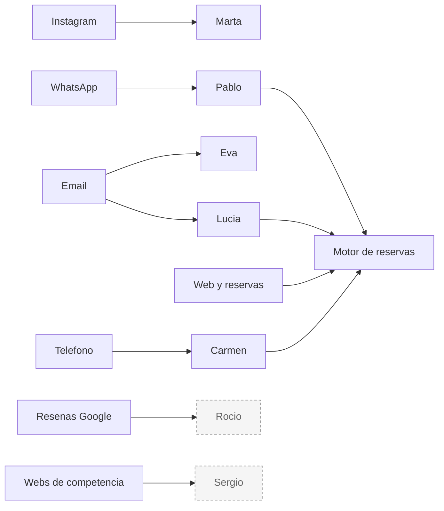
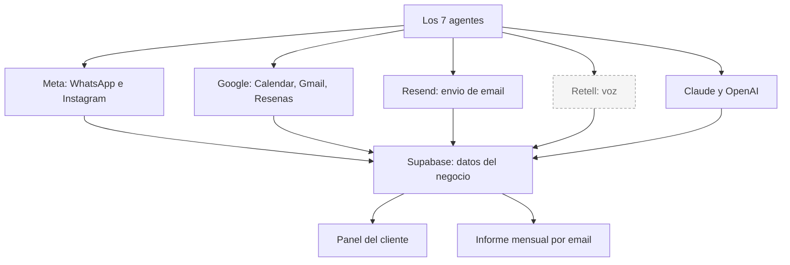
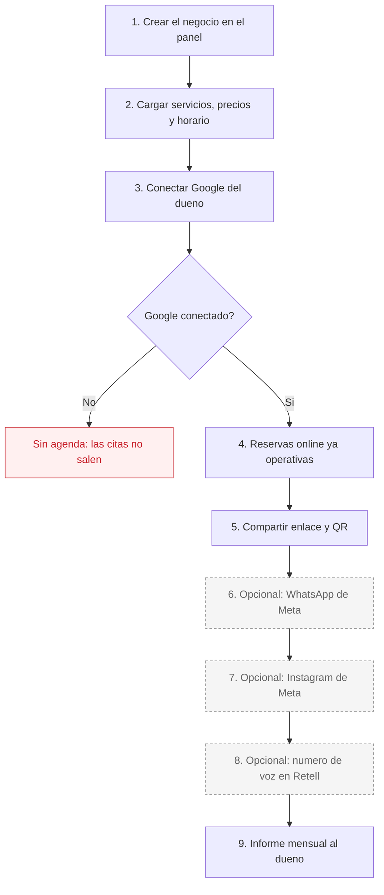

# AI-Team — Dosier maestro

**Fecha de la auditoría:** 28 de julio de 2026 · rama `sistema-operativo`.

Este documento describe **solo lo que existe en el código de este repositorio**. No es material comercial. Si una función está construida pero apagada, aquí se dice y se dice qué la bloquea.

## Cómo leer los estados

| Estado | Significa |
|---|---|
| ✅ **FUNCIONA HOY** | El código está completo y no depende de ningún permiso ni interruptor pendiente. |
| ⚠️ **LISTO PERO APAGADO** | El código está completo, pero hay algo que lo frena: un permiso de Meta o Google, una variable de entorno, o una conexión que el cliente no ha hecho. |
| ❌ **NO EXISTE** | No está construido. |
| ❓ **NO VERIFICABLE** | No se puede comprobar leyendo el repositorio. Se explica por qué. |

### Qué no se puede comprobar desde el código

Hay cuatro cosas que este dosier **no** afirma, porque no viven en el repositorio:

1. **Si una variable de entorno está puesta en producción.** Los valores reales están en Vercel, cifrados. Las variables marcadas como *Sensitive* ni siquiera se pueden descargar (`docs/meta-app-review.md` documenta un intento fallido: devuelve el literal `[SENSITIVE]`).
2. **Si Meta ha aprobado los permisos de Instagram y WhatsApp.** Eso se ve en el panel de Meta, no en el código.
3. **Si Google ha aprobado el acceso a la API de reseñas.** Igual: es una solicitud externa.
4. **Qué automatizaciones hay montadas en n8n.** n8n corre en un servidor aparte. El código expone los endpoints, pero no sabe si alguien los está llamando.

---

## Qué es AI-Team

Una plataforma para negocios de servicios en España (clínicas, peluquerías, centros de estética, restaurantes). Ofrece siete agentes de inteligencia artificial que atienden canales distintos, más un motor de reservas propio y un informe mensual.

Tiene dos caras:

- **La web pública** (`aiteam.marketing`): páginas de sector, blog, precios, alta.
- **El panel del cliente** (`/dashboard`): una pestaña por agente, agenda, reservas, informes. Requiere identificarse.

Todo corre sobre Vercel. Los datos se guardan en Supabase (usado como almacén de clave-valor). En desarrollo local, si no hay Supabase, cae a ficheros JSON.

---

## Diagrama 1 — De dónde llegan los clientes y quién los atiende

Las cajas con borde discontinuo (**Rocío** y **Sergio**) no están funcionando hoy. El detalle está más abajo y en su ficha.

## Diagrama 2 — Servicios externos y dónde acaba todo

Retell (las llamadas de voz) aparece discontinuo: el código para recibir sus llamadas existe, pero el agente de voz hay que darlo de alta en Retell, y eso no se puede comprobar desde aquí.

---

## Los 7 agentes de un vistazo

| Agente | Canal | Estado real | Qué lo frena |
|---|---|---|---|
| **Pablo** | WhatsApp | ⚠️ Listo, depende de Meta | Necesita token de WhatsApp Business válido y el número dado de alta. No verificable desde el código. |
| **Marta** | Instagram | ⚠️ Parcial | Crear y programar contenido: ✅ funciona. Publicar solo en Instagram: apagado (dos interruptores + permiso de Meta). Responder comentarios con mensaje privado: apagado. |
| **Eva** | Email marketing | ✅ Funciona | Envía de verdad con Resend. Los envíos automáticos programados dependen de que algo llame a sus dos tareas periódicas. |
| **Lucía** | Correo y agenda | ✅ Funciona | Requiere que el dueño conecte su cuenta de Google. Sin esa conexión no hay ni correo ni calendario. |
| **Rocío** | Reseñas de Google | ⚠️ Listo pero con datos de prueba | Google no ha dado acceso a su API de reseñas. Hoy trabaja contra datos simulados. |
| **Carmen** | Llamadas de voz | ⚠️ Listo por nuestra parte | El código que recibe las llamadas existe. Falta configurar el agente de voz y el número en Retell. |
| **Sergio** | Vigilancia de competencia | ⚠️ Listo pero apagado | Necesita una clave de Firecrawl para leer webs. Sin ella falla. Los datos de ejemplo que se ven son ficticios. |

> Nota: dentro del código, en `agents.ts`, cada agente tiene una frase de estado (por ejemplo *"Operativa · modo manual con IA"*). Son **etiquetas para la interfaz**, no una comprobación técnica. Este dosier se basa en el código que hace el trabajo, no en esas etiquetas.

---

## Qué ejecuta un cliente hoy, de verdad

Esto es lo que un negocio puede usar hoy sin depender de ninguna aprobación externa:

| Función | Estado | Detalle |
|---|---|---|
| Página pública de reservas | ✅ | Cada negocio tiene su dirección propia. El cliente final elige servicio, profesional y hora. |
| Agenda del dueño | ✅ | Vista de día y semana, arrastrar para mover citas, bloqueos, citas a mano. |
| Reserva sincronizada con Google Calendar | ✅ | Requiere que el dueño haya conectado Google. Un solo evento, sin duplicados. |
| Confirmación y recordatorio al cliente final | ✅ | Por email siempre. Por WhatsApp, si hay credenciales de Meta. |
| Aviso al dueño de cita nueva o cancelada | ⚠️ | Existe, con interruptor propio (`OWNER_NOTIFY_ENABLED`). No verificable si está activo en producción. |
| Cancelar o cambiar cita sin llamar | ✅ | Enlace con código único, se envía en la confirmación. |
| Ficha de clientes e historial | ✅ | Nuevos frente a recurrentes, últimas visitas. |
| Informes del negocio en el panel | ✅ | Ingresos, citas, ocupación, no-shows, por servicio y profesional. |
| Informe mensual por email | ⚠️ | El informe se genera y se envía por Resend, pero alguien tiene que disparar el proceso una vez al mes desde fuera. |
| Compartir enlace y código QR | ✅ | Descarga el QR desde el panel. |
| Crear el contenido del mes de Instagram | ✅ | Imágenes con la marca del negocio, textos y horas. Queda programado. |
| Publicar ese contenido en Instagram | ⚠️ | Apagado. Ver la ficha de Marta. |
| Lista de espera al liberarse un hueco | ⚠️ | Construido, apagado por interruptor, y todavía sin desplegar a producción. |

---

## Qué hace falta para que un negocio nuevo esté operativo

### Diagrama 3 — Alta de un negocio, paso a paso

Los pasos 6, 7 y 8 aparecen discontinuos porque hoy dependen de aprobaciones y altas externas.

### Detalle de cada conexión

**1. Google Calendar — imprescindible para las reservas**

Es la pieza crítica y la más fácil de pasar por alto. El sistema busca el calendario así: primero el correo que tenga puesto el negocio; si no, el correo del cliente; si no, el del fundador. Después busca los permisos de Google guardados **para ese correo concreto**.

Consecuencia práctica: si el dueño de un negocio nuevo no conecta su Google **con ese mismo correo**, no hay permisos guardados y las citas no llegan a ningún calendario. La conexión se hace desde la pestaña de Lucía en el panel.

> Aviso honesto: el módulo de calendario dice en sus propios comentarios que el ámbito actual es **de un solo cliente durante la beta**, y que resolver el calendario por cliente queda pendiente. La estructura para varios clientes existe (cada negocio guarda su correo de calendario), pero el comentario del código avisa de que no se ha completado. **No se ha probado con un segundo negocio real con calendario propio.**

**2. WhatsApp (Pablo)**

Hace falta un número de WhatsApp Business dado de alta en Meta, con su identificador y un token de acceso, más un token de verificación para conectar el webhook. Si falta cualquiera de los dos primeros, el sistema no envía y devuelve un error de "faltan credenciales". Que el número esté aprobado por Meta **no se puede comprobar desde el código**.

**3. Instagram (Marta)**

Hace falta la cuenta de Instagram de empresa vinculada a una página de Facebook, más un token. Para enviar mensajes privados el sistema intercambia el token por uno de página, cosa que ya hace solo. Publicar, responder comentarios y enviar mensajes privados requieren **permisos que Meta tiene que aprobar uno a uno**.

**4. Teléfono (Carmen)**

Hace falta contratar un número en Retell, crear allí el agente de voz y darle de alta las funciones que apuntan a este sistema, protegidas con un secreto compartido. Nada de eso vive en este repositorio.

**5. Correo**

Los envíos salen por Resend con una dirección verificada. Es una sola cuenta para toda la plataforma, no una por cliente.

---

## Bloqueadores actuales

| Bloqueador | A quién afecta | Qué desbloquea |
|---|---|---|
| **Permisos de Instagram sin aprobar por Meta** | Marta | Publicar automáticamente, responder comentarios por privado y mantener conversaciones por mensaje directo. |
| **Acceso a la API de reseñas sin aprobar por Google** | Rocío | Todo. Hoy funciona contra datos de prueba. |
| **Interruptores apagados** | Marta, lista de espera, avisos al dueño | Son variables que hay que poner a `true`. Se pueden activar sin tocar código, pero algunas además necesitan la aprobación de Meta. |
| **Sin clave de Firecrawl** | Sergio | Leer webs de competidores. Sin la clave, el proceso falla directamente. |
| **Tareas periódicas fuera de Vercel** | Eva, Lucía, Sergio, Marta, informe mensual | Hoy Vercel solo ejecuta dos. El resto son endpoints listos que alguien tiene que llamar desde n8n. **No es un límite de cantidad** (caben 100): las que se ejecutan varias veces al día no pueden ir en Vercel con el plan actual, las diarias o menos frecuentes sí. |
| **Agente de voz sin dar de alta en Retell** | Carmen | Que el teléfono suene y conteste. |
| **Calendario por cliente sin cerrar** | Reservas de un negocio nuevo | Que un segundo negocio use su propio calendario, no el del fundador. |

### Sobre las tareas programadas

En el repositorio, el fichero de configuración de Vercel tiene **tres** tareas: la evaluación nocturna, la generación diaria de propuestas de Marta y los recordatorios de reservas. La última se añadió en cambios locales que **todavía no están desplegados**; lo publicado tiene **dos**.

> **Corrección (28 de julio de 2026).** Una versión anterior de este dosier repetía lo que dicen los comentarios del código: que el plan contratado solo admite **dos** tareas programadas. **Eso ya no es cierto.** Verificado contra la cuenta y la documentación vigente de Vercel:
>
> - La cuenta está en el plan **Hobby**.
> - El límite de Hobby es de **100 tareas programadas por proyecto**, igual que en los planes de pago.
> - La restricción real de Hobby no es la cantidad, sino la **frecuencia**: cada tarea puede ejecutarse **como mucho una vez al día**, y la hora no es exacta (puede retrasarse hasta 59 minutos).
>
> Las tres tareas actuales se ejecutan una vez al día, así que **desplegar tal como está no daría error**. Y el hueco para mover ahí endpoints que hoy dependen de n8n es mucho mayor de lo que se creía: caben los que se ejecuten una vez al día o menos.

Estos endpoints existen y están listos, pero **nadie los llama desde Vercel**: informe mensual, generación del mes de Marta, publicación automática de Marta, las dos tareas de Eva, el resumen diario de Lucía y las tres de Sergio. Todos aceptan una llamada desde fuera protegida con un secreto compartido.

---

## Fichas por agente

- [Pablo — WhatsApp](pablo.md)
- [Marta — Instagram](marta.md)
- [Eva — Email marketing](eva.md)
- [Lucía — Correo y agenda](lucia.md)
- [Rocío — Reseñas de Google](rocio.md)
- [Carmen — Llamadas de voz](carmen.md)
- [Sergio — Vigilancia de competencia](sergio.md)
- [Guion de soporte](soporte.md)
