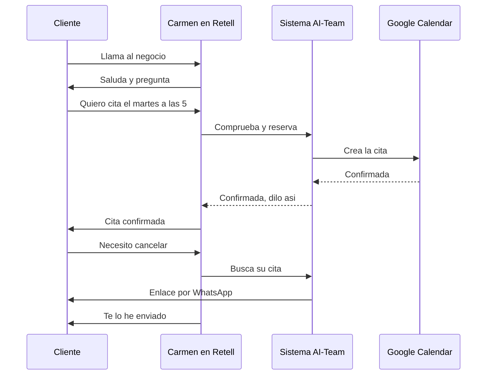

# Carmen — Llamadas de voz

**Estado global: ⚠️ LISTO POR NUESTRA PARTE, FALTA EL ALTA EN RETELL**

Todo lo que tiene que hacer este sistema cuando entra una llamada está construido y probado. Lo que falta es lo que vive fuera: el agente de voz y el número de teléfono, que se dan de alta en Retell.

---

## Qué hace

Contesta el teléfono del negocio. Habla en español, conoce los servicios y la disponibilidad, agenda citas durante la llamada y ayuda a cancelar o cambiar una cita.

## Qué hace HOY de verdad

| Capacidad | Estado | Detalle |
|---|---|---|
| Agendar una cita durante la llamada | ✅ | Está probado: crea una cita real en el calendario. Contesta en el momento para que Carmen pueda confirmar o proponer otra hora. |
| Entender fechas habladas | ✅ | Reconoce lenguaje natural: *"mañana a las diez y media"*, *"el 20 de julio a las cinco de la tarde"*, *"pasado mañana"*. |
| Ayudar a cancelar o cambiar | ✅ | Busca las citas activas por el teléfono desde el que llaman y **manda el enlace por WhatsApp**. No dicta la dirección web por teléfono, que sería un desastre. |
| Registrar la llamada al colgar | ✅ | Retell manda los datos extraídos de la conversación y el sistema los procesa. |
| Proteger las llamadas entrantes | ✅ | Con un secreto compartido, comprobado de forma segura. |
| Generar guiones de conversación | ✅ | En el panel: saludo, agendar, cancelar, información, queja, ausencia. |
| Escuchar cómo suena un texto | ✅ | Convierte texto en voz para probar. Necesita clave de OpenAI. |
| **Que el teléfono suene y conteste** | ⚠️ | Depende del alta en Retell. ❓ No verificable desde el código. |

## Qué necesita para funcionar

| Necesita | Para qué | Si falta |
|---|---|---|
| Cuenta y número en Retell | Recibir llamadas | El teléfono no suena. |
| Agente de voz creado en Retell | Que hable | No hay nadie al otro lado. |
| Funciones dadas de alta en Retell | Agendar y cancelar en la llamada | Carmen habla pero no puede hacer nada. |
| Secreto compartido | Seguridad | El sistema rechaza las llamadas de Retell. |
| Google conectado | Crear la cita | La cita no se puede crear. |
| WhatsApp funcionando | Mandar el enlace de cancelación | Carmen no puede enviar el enlace. |
| Clave de OpenAI | Probar voces en el panel | Solo afecta a la prueba, no al servicio. |

**Nada de la columna "Retell" está en este repositorio.** Es configuración en el panel de otro proveedor.

## Cómo se configura desde el panel

En la pestaña de Carmen hay un generador de guiones y un chat de pruebas. Sirve para preparar lo que Carmen debe decir en cada situación, pero **ese texto hay que llevarlo al panel de Retell a mano**: el sistema no lo envía solo.

La configuración que sí es automática es la del negocio: servicios, precios y horarios salen del motor de reservas.

## Qué lo dispara

| Disparador | Dónde vive | Estado |
|---|---|---|
| Carmen pide una cita durante la llamada | Retell llama al sistema en directo | ✅ Listo y probado |
| Carmen pide cancelar durante la llamada | Retell llama al sistema en directo | ✅ Listo |
| Fin de la llamada | Retell manda un resumen | ✅ Listo |
| Ninguna tarea programada | — | Carmen es puramente reactiva |

## Flujo real

El punto frágil es el primero: **hoy no está confirmado que exista un número dado de alta que levante a Carmen**. Del cuarto paso en adelante, todo está construido y probado.

## Limitaciones conocidas

- **La parte de fuera no está.** El agente de voz y el número se dan de alta en Retell, y no se puede comprobar desde aquí si están.
- **Hay un caso de fechas que falla:** cuando se dice la hora antes del día (*"a las cinco del martes"*), interpreta mal el día. La recomendación que hay en el código es que el guion de Carmen pregunte siempre el día primero.
- **Los guiones se copian a mano** al panel de Retell.
- **Si no viene el negocio en la llamada, usa uno por defecto.** Está pensado para el piloto. Con varios negocios habría que asegurarse de que cada número manda su identificador.
- **En la descripción comercial se menciona otro proveedor de voz.** El código está escrito contra Retell. Las etiquetas de la interfaz no reflejan lo implementado.
