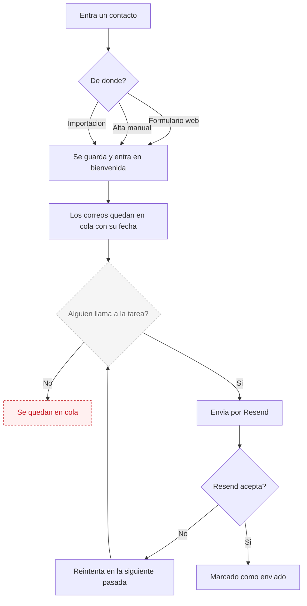

# Eva — Email marketing

**Estado global: ✅ FUNCIONA HOY**

Es el agente con menos dependencias externas. Envía correos de verdad. Lo único que hay que resolver es quién dispara los envíos programados.

---

## Qué hace

Gestiona la base de contactos del negocio y les manda correos: bienvenidas, secuencias automáticas, campañas puntuales y recuperación de clientes que hace tiempo que no vienen. También puede recibir respuestas.

## Qué hace HOY de verdad

| Capacidad | Estado | Detalle |
|---|---|---|
| Enviar correos reales | ✅ | A través de Resend, desde una dirección verificada. |
| Guardar contactos | ✅ | Alta manual, importación en bloque y captación por formulario. |
| Formulario de captación para la web | ✅ | Se genera un código para pegar en la web del negocio. Los contactos entran solos. |
| Serie de bienvenida | ✅ | Un contacto nuevo entra en una secuencia de varios correos. |
| Secuencias por sector | ✅ | Hay secuencias distintas según el tipo de negocio. |
| Programar un correo para más tarde | ✅ | Queda en cola con fecha y hora. |
| Plantillas reutilizables | ✅ | Se guardan y cuentan cuántas veces se han usado. |
| Baja de la lista | ✅ | Enlace propio para darse de baja. |
| Recibir respuestas de clientes | ⚠️ | El sistema tiene la puerta abierta, pero hace falta configurar el reenvío de correo fuera de este sistema. |
| Reactivar clientes dormidos | ✅ | Busca quien no viene hace más de 60 días, sin cita futura y con correo. No repite antes de 30 días. |
| Reintentar si un envío falla | ✅ | Si Resend rechaza un correo, se reintenta en la siguiente pasada, con un tope para no insistir eternamente. |

## Qué necesita para funcionar

| Necesita | Para qué | Si falta |
|---|---|---|
| Clave de Resend | Enviar | **No envía nada.** En local, sin clave, escribe en el registro lo que habría enviado. Útil para probar sin molestar a nadie. |
| Dirección de envío verificada | Que no caiga en spam | Usa una dirección de pruebas por defecto. |
| Clave de Claude | Redactar textos | Las plantillas manuales siguen funcionando. |
| Alguien que llame a las tareas periódicas | Envíos programados y secuencias | **Los correos se quedan en cola y no salen.** |
| Reenvío de correo entrante configurado | Recibir respuestas | Las respuestas del cliente no llegan al sistema. |

## Cómo se configura desde el panel

En la pestaña de Eva:

- **Contactos**: alta manual o importación.
- **Formulario de captación**: se copia el código y se pega en la web.
- **Automatización**: se define la serie de bienvenida y las secuencias.
- **Plantillas**: textos guardados.
- **Chat**: para pedirle que redacte.

La reactivación de clientes dormidos no está en la pestaña de Eva: está en el panel de **Reservas**, en la ficha de clientes, porque necesita el historial de citas.

## Qué lo dispara

| Disparador | Dónde vive | Estado |
|---|---|---|
| Envío inmediato | El dueño, desde el panel | ✅ Funciona |
| Cola de programados y bienvenidas | Endpoint pensado para llamarse cada 15 minutos | ⚠️ **No está en Vercel.** Hay que llamarlo desde n8n. |
| Secuencias y clientes fríos | Endpoint pensado para llamarse cada hora | ⚠️ **No está en Vercel.** Hay que llamarlo desde n8n. |
| Nuevo contacto por formulario | En tiempo real | ✅ Funciona |

> Los comentarios del código mencionan un servicio externo de tareas programadas. **No se puede comprobar desde el repositorio si esas llamadas están montadas.** Si no lo están, los correos programados no salen nunca.

## Flujo real

El punto discontinuo es el único de verdad frágil: si nadie llama a la tarea, todo lo demás funciona pero los correos no salen.

## Limitaciones conocidas

- **Los envíos programados dependen de una llamada externa.** Es la limitación principal. El envío inmediato desde el panel sí funciona siempre.
- **Una sola dirección de envío para toda la plataforma.** Los correos salen de la dirección de AI-Team, no de la del negocio. En algunos correos se firma con el nombre del negocio, pero la dirección real no cambia.
- **Recibir respuestas requiere configuración externa** que no está en este repositorio.
- **La reactivación de dormidos solo mira citas.** Necesita el motor de reservas con historial. Un negocio sin reservas no la puede usar.
