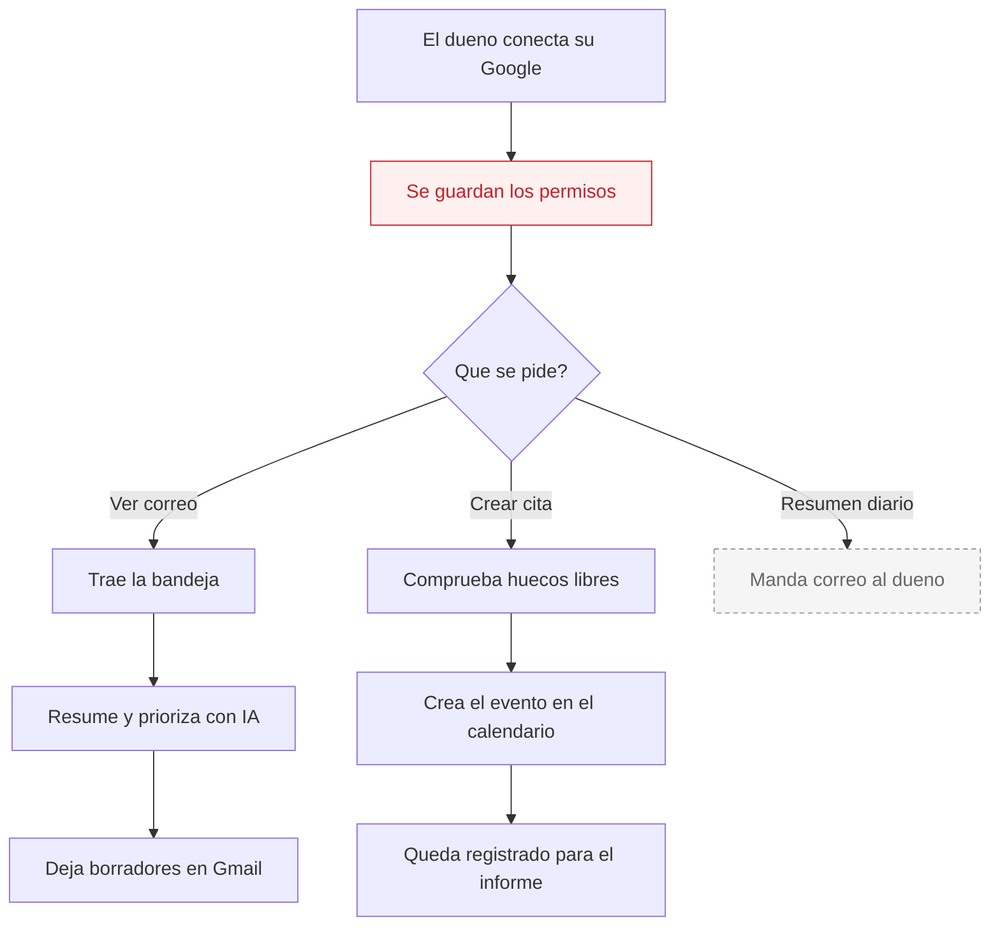

# Lucía — Correo y agenda

**Estado global: ✅ FUNCIONA HOY (si el dueño conecta su Google)**

Lucía es, además, **la pieza de la que depende todo el sistema de reservas**. La conexión con Google que ella hace es la que usan Pablo, Carmen y el motor de reservas para escribir en el calendario.

---

## Qué hace

Se conecta a la cuenta de Google del dueño. Lee la bandeja de entrada, la ordena, prepara borradores de respuesta y gestiona el calendario.

## Qué hace HOY de verdad

| Capacidad | Estado | Detalle |
|---|---|---|
| Conectar la cuenta de Google | ✅ | Con el sistema oficial de permisos de Google. El dueño autoriza desde el panel. |
| Leer la bandeja de entrada | ✅ | Trae los correos recientes. |
| Resumir y priorizar el correo | ✅ | Con IA: qué es urgente, qué puede esperar. |
| Preparar borradores de respuesta | ✅ | Los deja como borrador en Gmail. **No envía nada solo.** |
| Limpiar promociones | ✅ | Identifica correo promocional y lo aparta. |
| Ver el calendario | ✅ | Consulta huecos libres y ocupados. |
| Crear citas en el calendario | ✅ | Es el motor que usan todos los demás agentes. |
| Resumen diario por correo | ⚠️ | El código existe y está pensado para las 07:00. **Nadie lo llama desde Vercel.** |
| Reservar desde su panel | ✅ | Hay una herramienta de reserva integrada. |

## Por qué Lucía es la pieza crítica

El sistema guarda los permisos de Google **por dirección de correo**. Para escribir una cita en el calendario de un negocio, busca:

1. El correo de calendario que tenga configurado ese negocio.
2. Si no hay, el correo del cliente.
3. Si no hay, el correo del fundador.

Y después busca los permisos guardados **para esa dirección exacta**.

Consecuencia: **si el dueño de un negocio no ha conectado su Google desde la pestaña de Lucía, no hay permisos guardados y las citas de ese negocio no llegan a ningún calendario.**

> Aviso honesto: los comentarios del propio módulo de calendario dicen que el ámbito actual es **de un solo cliente durante la beta** y que resolver el calendario por cliente queda pendiente. La estructura para varios negocios existe, pero **no está verificado en el código que funcione con un segundo negocio con calendario propio**.

## Qué necesita para funcionar

| Necesita | Para qué | Si falta |
|---|---|---|
| Identificador y secreto de Google | Pedir permiso al dueño | No se puede conectar la cuenta. |
| Que el dueño autorice | Todo | Sin autorización no hay ni correo ni calendario. |
| Clave de Claude | Resumir y redactar | Se puede leer el correo, pero no hay resúmenes ni borradores. |
| Clave de Resend | Enviar el resumen diario | No llega el resumen. |
| Alguien que llame a la tarea diaria | Resumen de las 07:00 | No llega nunca. |

El permiso que pide incluye también el calendario, por eso una sola autorización sirve para las dos cosas.

## Cómo se configura desde el panel

En la pestaña de Lucía hay un botón para conectar Google. Se abre la pantalla de Google, el dueño acepta y vuelve al panel. A partir de ahí aparecen la bandeja, el calendario y la herramienta de reservas.

Si la conexión falla o caduca, la propia pantalla lo indica y ofrece reconectar.

## Qué lo dispara

| Disparador | Dónde vive | Estado |
|---|---|---|
| El dueño entra al panel | En el momento | ✅ Funciona |
| Otro agente necesita crear una cita | En el momento | ✅ Funciona |
| Resumen diario de las 07:00 | Endpoint listo | ⚠️ **No está en Vercel.** Hay que llamarlo desde n8n. |

## Flujo real

La caja roja es la que hay que vigilar: **sin ese paso, nada de lo demás funciona**. La discontinua (resumen diario) está construida pero nadie la dispara.

## Limitaciones conocidas

- **La conexión de Google caduca.** Hay un punto pendiente en el trabajo del proyecto sobre la caducidad semanal de los permisos. Cuando caduca, hay que reconectar a mano. El sistema detecta que está desconectado y lo avisa.
- **Lucía nunca envía correo sola.** Deja borradores. Es una decisión de diseño, no una carencia.
- **El resumen diario no se dispara solo.**
- **Un solo calendario en la práctica.** Ver el aviso de arriba.
- **La reserva desde el panel de Lucía y la del motor de reservas apuntan al mismo evento** de Google, para no duplicar citas. Pero solo el motor de reservas crea el registro que se ve en la agenda del panel de reservas.
