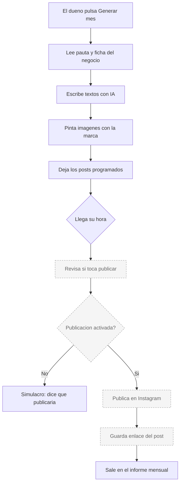
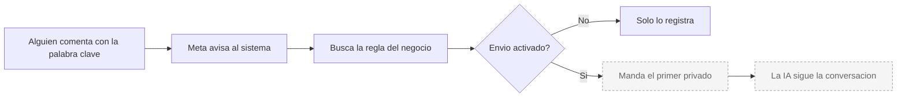

# Marta — Instagram y redes

**Estado global: ⚠️ PARCIAL**

Crear y programar contenido funciona hoy. **Publicarlo automáticamente no.** Es el agente con más funciones construidas y también con más cosas apagadas.

---

## Qué hace

Prepara el contenido de Instagram del negocio: la imagen con su marca, el texto, los hashtags y la hora. Se puede generar el mes entero de una vez. También puede responder comentarios con un mensaje privado y mantener conversaciones por mensaje directo.

## Qué hace HOY de verdad

| Capacidad | Estado | Detalle |
|---|---|---|
| Generar el calendario del mes | ✅ | Una acción genera todos los posts del mes: imagen, texto, hashtags y hora. |
| Imagen con la marca del negocio | ✅ | Colores, logo y tipo de plantilla propios de cada negocio. Se genera en el propio sistema, sin coste externo. |
| Imagen creada con IA | ⚠️ | Existe, pero necesita clave de OpenAI. Sin ella no se genera. |
| Escribir el texto y los hashtags | ✅ | Los redacta Claude a partir de la ficha del negocio. |
| Elegir días y horas de publicación | ✅ | Se marcan los días de la semana y la hora de cada uno. |
| Subir un post propio | ✅ | El dueño sube su foto, escribe (o pide que se lo escriban) y lo programa. |
| Cambiar fecha y hora de un post | ✅ | Desde la propia tarjeta del post. |
| Rehacer el texto o la imagen | ✅ | Dos botones por post. No crea uno nuevo: cambia el que hay. |
| Borrar u ocultar un post | ✅ | Los no publicados se borran. Los publicados solo se ocultan, para no perder el registro. |
| Identidad visual del negocio | ✅ | Colores, logo, plantilla y llamada a la acción. Incluso puede proponer colores a partir de una captura de su Instagram. |
| **Publicar automáticamente en Instagram** | ⚠️ **APAGADO** | Ver más abajo. |
| **Generar el mes solo, sin que nadie entre** | ⚠️ **APAGADO** | Necesita un interruptor y que alguien llame al proceso desde fuera. |
| **Responder comentarios por privado** | ⚠️ **APAGADO** | Detecta la palabra clave y prepara el mensaje, pero no lo envía. |
| Conversar por mensaje directo | ⚠️ | El código está completo. Depende de un permiso de Meta. |
| Aprobar desde WhatsApp o desde la app | ✅ | La propuesta llega y se aprueba con un clic. Lo que está apagado es el paso siguiente. |
| Registrar los posts publicados | ✅ | Cada publicación real queda anotada con su fecha y su enlace, y sale en el informe mensual. |
| Publicar en LinkedIn | ⚠️ | Construido. Necesita token y organización de LinkedIn. |
| Publicar en TikTok | ❌ | Solo hay un hueco reservado. No está construido. |

## Los tres interruptores

Esto es lo más importante de entender de Marta. Hay tres variables que apagan cosas distintas:

| Interruptor | Qué apaga | Además necesita |
|---|---|---|
| Permiso de publicación | Que salga cualquier publicación en Instagram | Aprobación de Meta para publicar contenido |
| Publicación automática | Que los posts salgan solos a su hora | Que el anterior también esté activo |
| Generación automática | Que se genere el mes sin que nadie entre al panel | Que alguien llame al proceso una vez al mes |
| Comentario a mensaje privado | Que se envíe el privado al comentar | Aprobación de Meta para gestionar comentarios |

Con el permiso de publicación apagado, el sistema **simula**: dice exactamente qué publicaría y no llama a Instagram. Es a propósito, para poder probar sin riesgo.

En el panel se ven los tres interruptores con su estado real, arriba del calendario.

## Qué necesita para funcionar

| Necesita | Para qué | Si falta |
|---|---|---|
| Cuenta de Instagram de empresa | Todo | Nada funciona. |
| Página de Facebook vinculada | Enviar mensajes directos | El sistema intercambia el token por uno de página; sin la página, falla. |
| Token de acceso de Meta | Todo | No publica ni responde. |
| Clave de Claude | Escribir textos | No hay textos. |
| Clave de OpenAI | Imágenes creadas por IA | Las imágenes de marca sí funcionan; las de IA no. |
| Almacenamiento de imágenes | Que las imágenes no caduquen | **Importante:** sin él las imágenes caducan a los 45 días y la publicación fallaría. |
| Aprobación de Meta (3 permisos) | Publicar, comentarios y mensajes | ❓ No verificable desde el código. |

## Cómo se configura desde el panel

La pestaña de Marta tiene cuatro secciones:

1. **Calendario de posts** — es la principal. Dentro hay cuatro bloques plegables:
   - *Pauta y posts a generar*: días, horas y cuántos posts al mes. Botón para generar el mes.
   - *Identidad visual*: colores, logo, plantilla (marcada o suave) y llamada a la acción.
   - *Subir post propio*: foto, texto, fecha. Con opciones avanzadas para reel o story.
   - *Programado este mes*: las tarjetas de cada post, con sus botones.
2. **Empezar cuenta** — genera un lote inicial de publicaciones para una cuenta nueva.
3. **Historial** — lo ya hecho.
4. **Comentarios → DM** — las reglas de palabra clave y el mensaje que se enviaría.

## Qué lo dispara

| Disparador | Dónde vive | Estado |
|---|---|---|
| Propuestas diarias | Tarea programada en Vercel, cada día a las 08:00 UTC | ✅ Activa. Genera propuestas, **no publica**. |
| Generación del mes | Endpoint que hay que llamar desde n8n | ⚠️ Listo, pero requiere el interruptor de generación automática |
| Publicación automática | Endpoint que hay que llamar desde n8n | ⚠️ Listo, pero requiere los dos interruptores de publicación |
| Botón "Publicar ahora" | El dueño, desde el panel | ⚠️ Se salta el interruptor de automatización, **pero no el de publicación** |
| Comentario en Instagram | Meta avisa en tiempo real | ⚠️ Detecta y registra; el envío está apagado |
| Aprobación por WhatsApp o app | El dueño | ⚠️ Igual |

> Detalle que evita un error grave: la publicación automática **no** está en la tarea diaria de Vercel. Son endpoints distintos a propósito. Si se hubieran mezclado, la tarea diaria habría empezado a publicar sola en Instagram.

## Flujo real

Hoy el recorrido se detiene en el simulacro. Todo lo discontinuo requiere los interruptores y la aprobación de Meta.

### Comentario a mensaje privado

## Limitaciones conocidas

- **Sin aprobación de Meta no sale nada a Instagram.** Es el bloqueador principal. Hay tres permisos distintos: publicar contenido, gestionar comentarios y gestionar mensajes.
- **Las imágenes caducan a los 45 días** si no hay almacenamiento permanente configurado. Antes caducaban a las 24 horas, lo que rompía las publicaciones programadas del mes. Está corregido, pero sigue dependiendo de esa configuración. Afecta también a los logos y portadas de los negocios.
- **La hora exacta por negocio no se puede garantizar con la tarea de Vercel.** El plan actual solo permite una ejecución diaria. La hora concreta de cada día sí se respeta cuando la publicación la dispara n8n.
- **Las imágenes con IA necesitan clave de OpenAI.** Sin ella solo hay imágenes de marca (que, dicho sea de paso, son las que se ven consistentes).
- **TikTok no existe.** Solo hay un hueco preparado.
- **El texto tiene una regla oculta:** por defecto tiene prohibido mencionar que el negocio usa inteligencia artificial, porque está pensado para hablar como el negocio, no como AI-Team. Hay una excepción para la cuenta propia de AI-Team.
