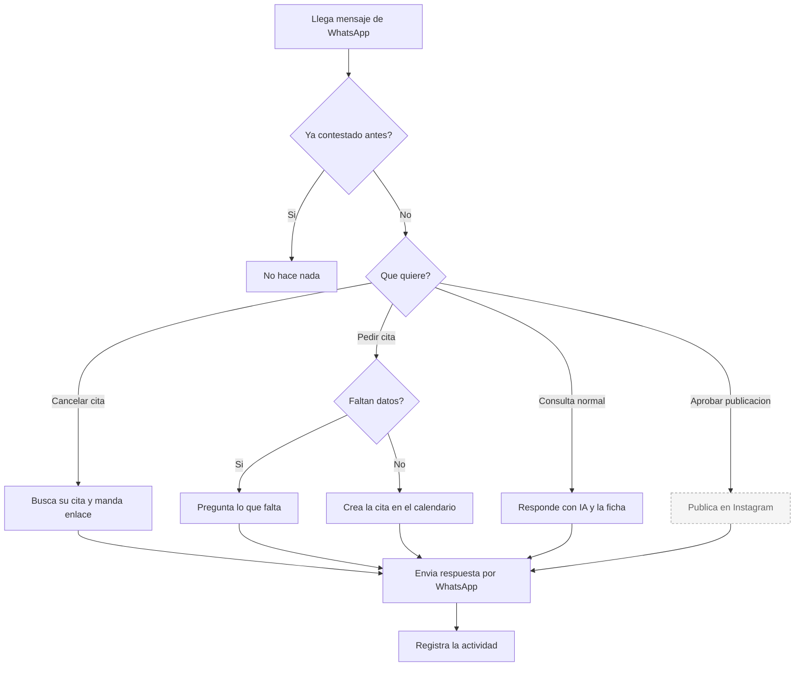

# Pablo — WhatsApp

**Estado global: ⚠️ LISTO, DEPENDE DE META**

El código está completo y es el agente más desarrollado del sistema. Que funcione o no depende de tener un número de WhatsApp Business activo con su token, y eso **no se puede comprobar desde el repositorio**.

---

## Qué hace

Atiende el WhatsApp del negocio. Un cliente escribe, Pablo lee, entiende y contesta. Por el camino puede reservar una cita, ayudar a cancelarla, o pasarle al dueño las propuestas de otros agentes para que las apruebe con un mensaje.

## Qué hace HOY de verdad

| Capacidad | Estado | Detalle |
|---|---|---|
| Recibir mensajes de WhatsApp | ✅ | Meta avisa, Pablo recoge el texto y el número. |
| Contestar con inteligencia artificial | ✅ | Usa un modelo rápido de Claude. El tono y el contenido salen de la ficha del negocio. |
| Adaptar el discurso al sector | ✅ | Hay guiones distintos para clínica dental, estética y venta general. |
| Recordar la conversación | ✅ | Guarda el hilo durante un día para no repetir preguntas ya hechas. |
| Reservar una cita desde el chat | ✅ | Detecta la intención, pide lo que falte y crea la cita en el calendario del negocio. |
| Cancelar o cambiar una cita | ✅ | Reconoce la intención, busca las citas activas de ese teléfono y manda el enlace para gestionarla. |
| Aprobar las publicaciones de Marta | ⚠️ | El circuito está completo, pero publicar en Instagram está apagado. |
| Aprobar las respuestas a reseñas de Rocío | ⚠️ | Igual: llega la propuesta, pero publicar depende de Google. |
| Enviar imágenes y vídeos | ✅ | Se usa para enseñar al dueño la publicación antes de aprobarla. |
| No responder dos veces al mismo mensaje | ✅ | Lleva control para que un reintento de Meta no genere una respuesta duplicada. |
| Registrar la actividad para el informe | ✅ | Cada mensaje que entra y sale queda contado. |

## Qué necesita para funcionar

| Necesita | Para qué | Si falta |
|---|---|---|
| Token de acceso de WhatsApp | Enviar mensajes | No envía nada. Devuelve "faltan credenciales". |
| Identificador del número emisor | Enviar mensajes | Igual que arriba. |
| Token de verificación del webhook | Que Meta conecte | Meta no valida la conexión y no llega ningún mensaje. |
| Clave de Claude | Generar respuestas | Contesta un mensaje genérico de "hemos recibido tu mensaje". **Es a propósito, no es un fallo.** |
| Número aprobado por Meta | Escribir a cualquiera | ❓ No verificable desde el código. |

## Cómo se configura desde el panel

En la pestaña de Pablo del panel hay un chat de pruebas para hablar con él sin usar WhatsApp, y herramientas de configuración.

Lo que de verdad define cómo habla no está en la pestaña de Pablo, sino en la **ficha del negocio**: nombre, sector, ciudad, tono, servicios principales, promociones y qué evitar decir. Se rellena en el alta y se puede editar después. El sector determina qué guion carga.

## Qué lo dispara

| Disparador | Dónde vive | Estado |
|---|---|---|
| Mensaje entrante de WhatsApp | Meta llama al sistema en cuanto llega | ✅ Es el disparador principal, en tiempo real |
| Ninguna tarea programada | — | Pablo no tiene tareas periódicas: es puramente reactivo |

## Flujo real

La caja discontinua (**publicar en Instagram**) está apagada hoy: la aprobación se registra, pero no sale la publicación.

## Limitaciones conocidas

- **Sin clave de Claude, contesta un mensaje genérico.** Está puesto a propósito para que nunca se quede callado, pero si alguien ve esa respuesta puede pensar que el agente está roto.
- **Escribir fuera de las 24 horas necesita plantillas aprobadas.** WhatsApp solo permite texto libre dentro de las 24 horas siguientes al último mensaje del cliente. Para avisos proactivos hace falta una plantilla aprobada por Meta. En el código hay avisos explícitos sobre esto en los recordatorios de reservas.
- **La reserva por chat entiende bastante lenguaje natural, pero no todo.** Hay un caso documentado que falla: cuando se dice la hora antes del día (*"a las 5 del martes"*), interpreta mal el día.
- **Un solo número para toda la plataforma.** El sistema identifica al negocio por el número emisor. Funciona, pero hoy solo hay un número configurado.
- **El control de mensajes repetidos necesita Supabase.** Sin él, en local, podría contestar dos veces al mismo mensaje.
