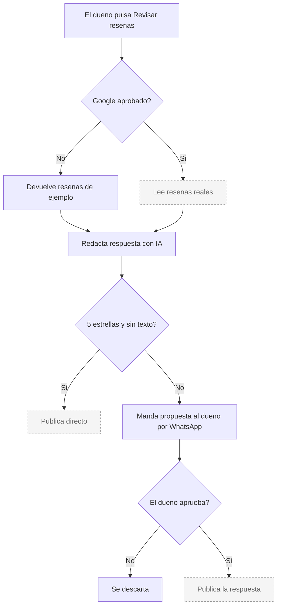

# Rocío — Reseñas de Google

**Estado global: ⚠️ LISTO PERO CON DATOS DE PRUEBA**

Todo el circuito está construido y se puede ver funcionando en el panel. Pero **las reseñas que se ven hoy son inventadas**, no son las del negocio. Google todavía no ha dado acceso a su interfaz de reseñas.

---

## Qué hace

Vigila las reseñas nuevas del negocio en Google, redacta una respuesta con el tono adecuado según la puntuación y la publica. Las respuestas delicadas pasan antes por el dueño para que las apruebe.

## Qué hace HOY de verdad

| Capacidad | Estado | Detalle |
|---|---|---|
| Conectar la cuenta de Google | ✅ | El circuito de permisos está montado, igual que el de Lucía. |
| Leer reseñas reales | ⚠️ **NO** | Google no ha dado acceso. Hoy devuelve reseñas de ejemplo. |
| Redactar la respuesta con IA | ✅ | Funciona de verdad, aunque sea sobre reseñas de ejemplo. El tono cambia según las estrellas. |
| Pedir aprobación al dueño | ✅ | La propuesta le llega por WhatsApp y contesta desde ahí. |
| Publicar la respuesta | ⚠️ **NO** | Depende del mismo acceso de Google. |
| Publicar solo las de 5 estrellas | ⚠️ | Está previsto: las de 5 estrellas sin texto se pueden publicar sin preguntar. Tiene interruptor propio, apagado por defecto. Las demás **siempre** pasan por el dueño. |
| Registrar para el informe | ✅ | Las reseñas recibidas y respondidas se cuentan. |
| Pedir reseñas a los clientes | ❌ **NO EXISTE** | En la descripción comercial del agente se dice que solicita reseñas tras cada visita. **No hay código que haga eso.** Solo responde a las que llegan. |

## El bloqueador

La interfaz de reseñas de Google es de acceso restringido: hay que pedirlo y esperar aprobación, que según los propios comentarios del código puede tardar días o semanas.

El código está preparado para ese día: cuando llegue la aprobación, basta con apagar el modo de pruebas y activar el acceso en la consola de Google. **No hace falta reescribir nada.**

## Qué necesita para funcionar

| Necesita | Para qué | Si falta |
|---|---|---|
| Aprobación de Google | Leer y responder reseñas reales | Todo funciona contra datos de ejemplo. |
| Activar la API en la consola de Google | Lo mismo | La conexión de permisos falla. |
| Identificador y secreto de Google | Conectar la cuenta | No se puede conectar. |
| Que el dueño autorice | Lo mismo | Sin autorización no hay reseñas. |
| Clave de Claude | Redactar respuestas | No hay respuestas. |
| WhatsApp funcionando | Que la aprobación llegue al dueño | Se crea la propuesta pero no le llega el aviso. |

## Cómo se configura desde el panel

En la pestaña de Rocío hay un panel en vivo que muestra si está en modo de pruebas y las reseñas pendientes. Desde ahí se lanza la revisión de reseñas nuevas.

El panel **avisa explícitamente de que está en modo de pruebas** y de que se desactivará cuando Google apruebe el acceso. Está bien resuelto: el cliente no puede confundirse.

## Qué lo dispara

| Disparador | Dónde vive | Estado |
|---|---|---|
| El dueño pulsa el botón en el panel | Es el único disparador | ✅ Funciona |
| Respuesta del dueño por WhatsApp | En el momento | ✅ El circuito funciona |
| **Ninguna tarea programada** | — | ❌ **Rocío no tiene ninguna tarea automática.** No revisa reseñas sola. |

Esto es importante: aunque llegara la aprobación de Google mañana, **Rocío seguiría sin funcionar sola**. Habría que montar una llamada periódica al proceso, y hoy ese endpoint no existe: la revisión se lanza desde una acción del panel.

## Flujo real

Todo lo discontinuo depende de la aprobación de Google. Hoy el recorrido real es: botón → reseñas de ejemplo → respuesta con IA → propuesta al dueño.

## Limitaciones conocidas

- **No pide reseñas a los clientes.** La descripción comercial dice que sí. El código no lo hace. Es la diferencia más grande entre lo que se promete y lo que existe.
- **Sin acceso de Google, todo lo que se ve es ficticio.** El panel lo avisa.
- **No se dispara solo.** No hay ninguna tarea programada.
- **Un solo negocio.** El código dice explícitamente que resuelve siempre el cliente por defecto y que el reparto por cliente queda para más adelante.
