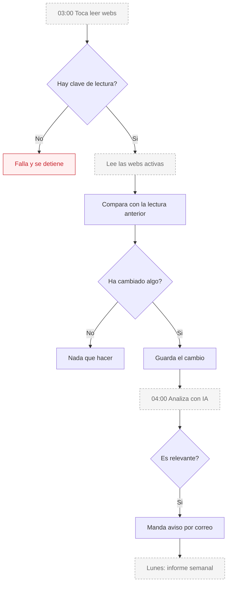

# Sergio — Vigilancia de competencia

**Estado global: ⚠️ LISTO PERO APAGADO**

Es el agente menos rodado. El circuito completo existe, pero **sin una clave de Firecrawl no lee ninguna web**, y lo que se ve hoy en el panel son competidores inventados.

---

## Qué hace

Vigila las webs de los competidores del negocio. Cuando algo cambia —un precio, una oferta, un servicio nuevo— lo detecta, lo analiza y avisa. Una vez por semana manda un informe.

## Qué hace HOY de verdad

| Capacidad | Estado | Detalle |
|---|---|---|
| Guardar las webs a vigilar | ✅ | Se dan de alta y se activan o desactivan. |
| Leer las webs | ⚠️ **NO** | Necesita clave de Firecrawl. **Sin ella el proceso falla directamente**, no hay respaldo. |
| Detectar qué ha cambiado | ✅ | Compara con la última lectura. |
| Analizar el cambio con IA | ✅ | Claude valora si es relevante. |
| Avisar por correo | ✅ | Manda la alerta con Resend. |
| Informe semanal | ✅ | Resumen ejecutivo por correo. |
| Ver competidores en el panel | ✅ | **Corregido el 28 de julio de 2026.** Antes se veían siete competidores inventados en el código (nombres, valoraciones y debilidades ficticias). Se han eliminado: ahora el panel lista solo las webs dadas de alta de verdad, y si no hay ninguna enseña un aviso de que Sergio no está configurado. |
| Informe rápido desde la pestaña del cliente | ⚠️ | **No lee la web del competidor.** Es una estimación generada con IA a partir de patrones del sector. El panel ahora lo dice explícitamente. |

## El bloqueador

Sin clave de Firecrawl, la lectura de webs lanza un error y se detiene. No hay modo alternativo ni datos parciales: o hay clave, o no hay vigilancia.

## Qué necesita para funcionar

| Necesita | Para qué | Si falta |
|---|---|---|
| Clave de Firecrawl | Leer webs | **Todo se para.** Es el bloqueador principal. |
| Clave de Claude | Analizar cambios | Detecta el cambio pero no lo interpreta. |
| Clave de Resend | Avisos e informe | No llega nada. |
| Alguien que llame a las tres tareas | Que funcione solo | No se ejecuta nunca. |

## Cómo se configura desde el panel

Hay dos sitios:

- **Pestaña de Sergio en el panel del cliente**: ver competidores y pedir análisis.
- **Zona de administración**: gestión de las fuentes a vigilar y los cambios detectados.

> **Corrección (28 de julio de 2026).** Una versión anterior de este dosier avisaba de que un panel de administración de Sergio leía un secreto desde el navegador. **Esa afirmación era incorrecta:** el problema existió, pero ya se había arreglado en un despliegue anterior. Hoy el botón de lanzar la lectura llama a una ruta propia que comprueba la sesión y usa el secreto solo en el servidor. Comprobado compilando con valores señuelo: **ningún secreto aparece en el código que llega al navegador.**

## Qué lo dispara

| Disparador | Dónde vive | Estado |
|---|---|---|
| Lectura de webs, cada día a las 03:00 | Endpoint listo | ⚠️ **No está en Vercel.** Hay que llamarlo desde n8n. |
| Análisis de cambios, cada día a las 04:00 | Endpoint listo | ⚠️ **No está en Vercel.** |
| Informe semanal, lunes a las 09:00 | Endpoint listo | ⚠️ **No está en Vercel.** |
| El dueño pide un análisis | Desde el panel | ✅ Funciona, dentro de sus límites |

Los tres tienen que ir en ese orden: primero leer, luego analizar, luego informar. Si se llaman desordenados, el análisis no encuentra nada nuevo.

## Flujo real

Hoy el recorrido real termina en la caja roja: sin clave, no se lee nada. Y aunque la hubiera, las tres cajas discontinuas necesitan que alguien las dispare desde fuera.

## Limitaciones conocidas

- **Sin clave de Firecrawl no funciona nada.** Y falla de golpe, no en modo degradado. Es el bloqueador que queda.
- ~~Los competidores del panel son inventados.~~ **Resuelto el 28 de julio de 2026.** Se borraron los datos falsos y ahora hay un estado vacío honesto.
- **Ninguna de sus tres tareas está programada en Vercel.** Se pueden añadir: el límite de tareas programadas no es el problema (ver el apartado de tareas en el dosier general), solo hay que respetar que en el plan actual cada una se ejecuta como mucho una vez al día.
- **Leer webs ajenas tiene sus límites.** Algunas webs bloquean la lectura automática y otras cambian de estructura. No hay nada en el código que garantice que la lectura seguirá funcionando en el tiempo.
- **Coste variable.** Cada lectura consume créditos de Firecrawl y cada análisis consume IA. Con muchos competidores y frecuencia diaria, el coste sube. No hay ningún tope en el código.
